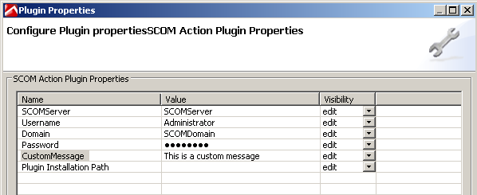
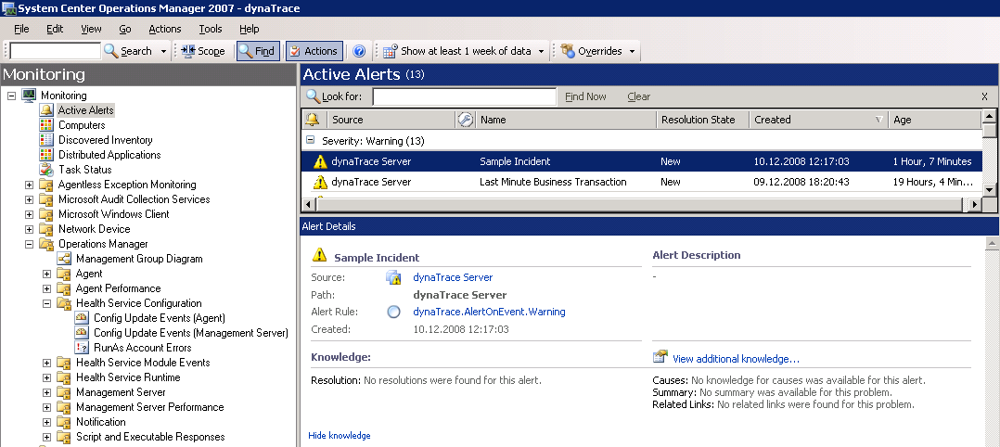
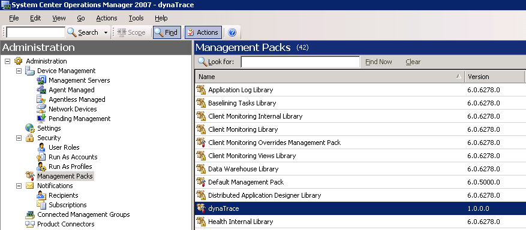
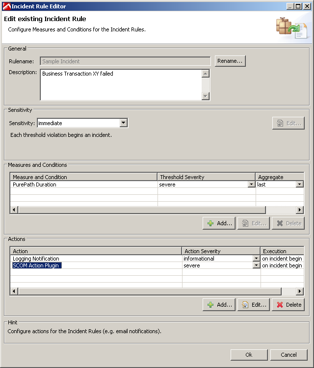
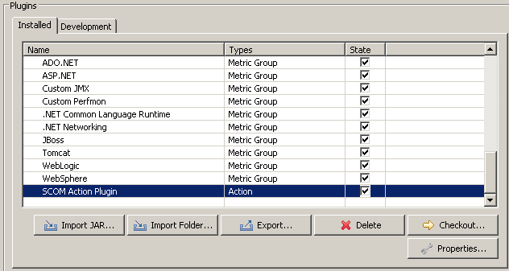

<html xmlns="http://www.w3.org/1999/xhtml">
<head>
    <title>Overview</title>
    <meta http-equiv="Content-Type" content="text/html; charset=UTF-8"/>
    <meta http-equiv="X-UA-Compatible" content="IE=EmulateIE8" />
    <meta content="Scroll Wiki Publisher" name="generator"/>
    <link type="text/css" rel="stylesheet" href="css/blueprint/liquid.css" media="screen, projection"/>
    <link type="text/css" rel="stylesheet" href="css/blueprint/print.css" media="print"/>
    <link type="text/css" rel="stylesheet" href="css/content-style.css" media="screen, projection, print"/>
    <link type="text/css" rel="stylesheet" href="css/screen.css" media="screen, projection"/>
    <link type="text/css" rel="stylesheet" href="css/print.css" media="print"/>
</head>
<body>
                <h1>Overview</h1>
    

            
            

    

This action plugin enables <strong class=" ">pushing dynaTrace Incident data to System Center Operations Manager 2007 - 2012</strong>    

    

        <table>
<thead class=" "></thead><tfoot class=" "></tfoot><tbody class=" ">    <tr>
            <td rowspan="1" colspan="1">
        

Name    

            </td>
                <td rowspan="1" colspan="1">
        

SCOM Action Monitoring Plugin for dynaTrace    

            </td>
        </tr>
    <tr>
            <td rowspan="1" colspan="1">
        

Plugin Version    

            </td>
                <td rowspan="1" colspan="1">
        

1.2 (updated by Eric Lazar to now also Support SCOM 2012)    

            </td>
        </tr>
    <tr>
            <td rowspan="1" colspan="1">
        

Compatible with    

            </td>
                <td rowspan="1" colspan="1">
        

dynaTrace 3.0+, dynaTrace 4.x, dynaTrace 5.x    

            </td>
        </tr>
    <tr>
            <td rowspan="1" colspan="1">
        

Tested with:    

            </td>
                <td rowspan="1" colspan="1">
        

System Center Operations Manager 2007 + 2012    

            </td>
        </tr>
    <tr>
            <td rowspan="1" colspan="1">
        

Author    

            </td>
                <td rowspan="1" colspan="1">
        

Andreas Grabner, Steve Caron, Eric Lazar    

            </td>
        </tr>
    <tr>
            <td rowspan="1" colspan="1">
        

Download    

            </td>
                <td rowspan="1" colspan="1">
        

<a href="attachments_160071690_2_dynaTrace_SCOMAlert_v1.2.zip">dynaTrace_SCOMAlert_v1.2.zip</a> (also works with SCOM 2012 - Thanks to Eric Lazar) <a href="attachments_134742218_1_dynaTrace_SCOMAlert_v1.1.zip">dynaTrace_SCOMAlert_v1.1.zip</a> (works with SCOM 2007  <a href="attachments_160071689_1_dynaTrace_SCOMAlert_v1.2_Source.zip">Download v1.2 Source</a>    

            </td>
        </tr>
    <tr>
            <td rowspan="1" colspan="1">
        

License    

            </td>
                <td rowspan="1" colspan="1">
        

<a href="attachments_5275722_2_dynaTraceBSD.txt">dynaTrace BSD</a>    

            </td>
        </tr>
    <tr>
            <td rowspan="1" colspan="1">
        

Support    

            </td>
                <td rowspan="1" colspan="1">
        

<a href="https://community/display/DL/Support+Levels#SupportLevels-Community">Community Supported</a>    

            </td>
        </tr>
    <tr>
            <td rowspan="1" colspan="1">
        

Screenshots    

            </td>
                <td rowspan="1" colspan="1">
        

<strong class=" ">Imported SCOM Action Plugin</strong>             
          <strong class=" ">Plugin Properties</strong>             
          <strong class=" ">Incident Definition</strong>             
          <strong class=" ">SCOM Management Pack Import</strong>             
          <strong class=" ">dynaTrace Alert in SCOM</strong>             
            

            </td>
        </tr>
    <tr>
            <td rowspan="1" colspan="1">
        

Install Description    

            </td>
                <td rowspan="1" colspan="1">
        

1) Install the dynaTrace_ManagementPack.xml in SCOM. You can do this in the Administration Pane in the SCOM Management Operation Console 2) Make sure to have the windows service &quot;OpsMgr SDK Service&quot; running. Verify that by looking at the list of windows services. 3) Initialize dynaTrace SCOM Objects by executing dynaTrace.SCOM.exe with the /i parameter. Execute dynaTrace.SCOM.exe without any parameters to get a list of options that you have. /i allows you to install the needed SCOM objects on your SCOM 2007 server. dynaTrace.SCOM.exe is a .NET Console Application. It requires an installed .NET 2.0 Framework. 4) Import the Action Plugin into the dynaTrace Server (via Server Preferences). Click on the Plugins tab and import com.dynatrace.diagnostics.plugin.SCOMAction_1.0.0.jar. After you have imported it you can specify default values for the plugin properties. 5) Use the Plugin as Action for an Incident. Make sure to configure all required properties of the Plugin <strong class=" "> </strong> <strong class=" ">Plugin-Properties</strong>    

<ul class=" "><li class=" ">    

SCOMServer: name of the server that runs SCOM    

</li><li class=" ">    

Username: username to authenticate on SCOM in order to send events to SCOM    

</li><li class=" ">    

Domain: windows domain name for the user    

</li><li class=" ">    

Password: password for the user    

</li><li class=" ">    

CustomMessage: if specified - this message will be part of the alert description that is generated in SCOM    

</li><li class=" ">    

Plugin Installation Path: (optional). You can install dynaTrace.SCOM.exe, dynaTrace.SCOM.exe.config and the two microsoft dlls in any directory on the dynaTrace Server machine. If you do so you can specify the installation directory here. If this parameter is not specified the dynaTrace.SCOM.exe will be extracted from the dynaTrace SCOM Alert Plugin and stored in a temporary directory on the dynaTrace server <strong class=" "> </strong> <strong class=" ">What is part of the SCOM Alert?</strong> dynaTrace sends an event to SCOM containing the name of the Incident as Event name, the description of the incident and optionally the custom message as event description and the defined severity as event severity. The event data will then be converted into a SCOM Alert by the dynaTrace Management Pack.    

</li></ul>            </td>
        </tr>
    <tr>
            <td rowspan="1" colspan="1">
        

Compatibility Matrix    

            </td>
                <td rowspan="1" colspan="1">
        

    

            </td>
        </tr>
    <tr>
            <td rowspan="1" colspan="1">
        

Known Problems    

            </td>
                <td rowspan="1" colspan="1">
        

The action plugin executes dynaTrace.SCOM.exe on the dynaTrace server. dynaTrace.SCOM.exe is a .NET Console Application. Therefore this Plugin only works on dynaTrace servers that run on windows with an installed version of the .NET 2.0 Framework.    

            </td>
        </tr>
    <tr>
            <td rowspan="1" colspan="1">
        

Disclaimer    

            </td>
                <td rowspan="1" colspan="1">
        

    

            </td>
        </tr>
</tbody>        </table>
            

    

    

    

        <table>
<thead class=" ">    <tr>
            <td rowspan="1" colspan="1">
        

&nbsp;    

            </td>
                <td rowspan="1" colspan="1">
        

<a href="SCOM_Action_Monitoring_Plugin.html">File</a>    

            </td>
                <td rowspan="1" colspan="1">
        

<a href="SCOM_Action_Monitoring_Plugin.html">Modified</a>    

            </td>
        </tr>
</thead><tfoot class=" "></tfoot><tbody class=" ">    <tr>
            <td rowspan="1" colspan="1">
                </td>
                <td rowspan="1" colspan="1">
        

ZIP Archive                    <a href="https://community/download/attachments/8651084/dynaTrace_SCOMAlert_v1.2.zip?api=v2">dynaTrace_SCOMAlert_v1.2.zip</a>    

            </td>
                <td rowspan="1" colspan="1">
        

Mar 14, 2014by<a href="    /community/display/~andreas.grabner@compuware.com ">Andreas Grabner</a>    

            </td>
        </tr>
    <tr>
            <td rowspan="1" colspan="1">
                </td>
                <td rowspan="1" colspan="2">
        

    

    

Labels    

<ul class="label-list has-pen "><li class="no-labels-message ">    

No labels    

</li><li class="labels-edit-container ">    

<a href="SCOM_Action_Monitoring_Plugin.html">Edit Labels</a>    

</li></ul>    

    

            </td>
        </tr>
    <tr>
            <td rowspan="1" colspan="1">
                </td>
                <td rowspan="1" colspan="1">
        

ZIP Archive                    <a href="https://community/download/attachments/8651084/dynaTrace_SCOMAlert_v1.2_Source.zip?api=v2">dynaTrace_SCOMAlert_v1.2_Source.zip</a>    

            </td>
                <td rowspan="1" colspan="1">
        

Mar 14, 2014by<a href="    /community/display/~andreas.grabner@compuware.com ">Andreas Grabner</a>    

            </td>
        </tr>
    <tr>
            <td rowspan="1" colspan="1">
                </td>
                <td rowspan="1" colspan="2">
        

    

    

Labels    

<ul class="label-list has-pen "><li class="no-labels-message ">    

No labels    

</li><li class="labels-edit-container ">    

<a href="SCOM_Action_Monitoring_Plugin.html">Edit Labels</a>    

</li></ul>    

    

            </td>
        </tr>
    <tr>
            <td rowspan="1" colspan="1">
                </td>
                <td rowspan="1" colspan="1">
        

ZIP Archive                    <a href="https://community/download/attachments/8651084/dynaTrace_SCOMAlert_Source.zip?api=v2">dynaTrace_SCOMAlert_Source.zip</a>    

            </td>
                <td rowspan="1" colspan="1">
        

Aug 13, 2013by<a href="    /community/display/~andreas.grabner@compuware.com ">Andreas Grabner</a>    

            </td>
        </tr>
    <tr>
            <td rowspan="1" colspan="1">
                </td>
                <td rowspan="1" colspan="2">
        

    

    

Labels    

<ul class="label-list has-pen "><li class="no-labels-message ">    

No labels    

</li><li class="labels-edit-container ">    

<a href="SCOM_Action_Monitoring_Plugin.html">Edit Labels</a>    

</li></ul>    

    

            </td>
        </tr>
    <tr>
            <td rowspan="1" colspan="1">
                </td>
                <td rowspan="1" colspan="1">
        

ZIP Archive                    <a href="https://community/download/attachments/8651084/dynaTrace_SCOMAlert_v1.1.zip?api=v2">dynaTrace_SCOMAlert_v1.1.zip</a>    

            </td>
                <td rowspan="1" colspan="1">
        

Aug 13, 2013by<a href="    /community/display/~andreas.grabner@compuware.com ">Andreas Grabner</a>    

            </td>
        </tr>
    <tr>
            <td rowspan="1" colspan="1">
                </td>
                <td rowspan="1" colspan="2">
        

    

    

Labels    

<ul class="label-list has-pen "><li class="no-labels-message ">    

No labels    

</li><li class="labels-edit-container ">    

<a href="SCOM_Action_Monitoring_Plugin.html">Edit Labels</a>    

</li></ul>    

    

            </td>
        </tr>
    <tr>
            <td rowspan="1" colspan="1">
                </td>
                <td rowspan="1" colspan="1">
        

PNG File                    <a href="https://community/download/attachments/8651084/icon.png?api=v2">icon.png</a>    

            </td>
                <td rowspan="1" colspan="1">
        

Mar 29, 2012by<a href="    /community/display/~wolfgang.gottesheim@compuware.com ">Wolfgang Gottesheim</a>    

            </td>
        </tr>
    <tr>
            <td rowspan="1" colspan="1">
                </td>
                <td rowspan="1" colspan="2">
        

            
            

    

Labels    

<ul class="label-list has-pen "><li class="no-labels-message ">    

No labels    

</li><li class="labels-edit-container ">    

<a href="SCOM_Action_Monitoring_Plugin.html">Edit Labels</a>    

</li></ul>    

    

            </td>
        </tr>
    <tr>
            <td rowspan="1" colspan="1">
                </td>
                <td rowspan="1" colspan="1">
        

ZIP Archive                    <a href="https://community/download/attachments/8651084/dynaTrace_SCOMAlert_v1.0.zip?api=v2">dynaTrace_SCOMAlert_v1.0.zip</a>    

            </td>
                <td rowspan="1" colspan="1">
        

Dec 10, 2008by<a href="    /community/display/~andreas.grabner@compuware.com ">Andreas Grabner</a>    

            </td>
        </tr>
    <tr>
            <td rowspan="1" colspan="1">
                </td>
                <td rowspan="1" colspan="2">
        

    

    

Labels    

<ul class="label-list has-pen "><li class="no-labels-message ">    

No labels    

</li><li class="labels-edit-container ">    

<a href="SCOM_Action_Monitoring_Plugin.html">Edit Labels</a>    

</li></ul>    

    

            </td>
        </tr>
    <tr>
            <td rowspan="1" colspan="1">
                </td>
                <td rowspan="1" colspan="1">
        

File                    <a href="https://community/download/attachments/8651084/plugin_properties.PNG?api=v2">plugin_properties.PNG</a>    

            </td>
                <td rowspan="1" colspan="1">
        

Dec 10, 2008by<a href="    /community/display/~andreas.grabner@compuware.com ">Andreas Grabner</a>    

            </td>
        </tr>
    <tr>
            <td rowspan="1" colspan="1">
                </td>
                <td rowspan="1" colspan="2">
        

            
            

    

Labels    

<ul class="label-list has-pen "><li class="no-labels-message ">    

No labels    

</li><li class="labels-edit-container ">    

<a href="SCOM_Action_Monitoring_Plugin.html">Edit Labels</a>    

</li></ul>    

    

            </td>
        </tr>
    <tr>
            <td rowspan="1" colspan="1">
                </td>
                <td rowspan="1" colspan="1">
        

File                    <a href="https://community/download/attachments/8651084/alerts_in_scom.PNG?api=v2">alerts_in_scom.PNG</a>    

            </td>
                <td rowspan="1" colspan="1">
        

Dec 10, 2008by<a href="    /community/display/~andreas.grabner@compuware.com ">Andreas Grabner</a>    

            </td>
        </tr>
    <tr>
            <td rowspan="1" colspan="1">
                </td>
                <td rowspan="1" colspan="2">
        

            
            

    

Labels    

<ul class="label-list has-pen "><li class="no-labels-message ">    

No labels    

</li><li class="labels-edit-container ">    

<a href="SCOM_Action_Monitoring_Plugin.html">Edit Labels</a>    

</li></ul>    

    

            </td>
        </tr>
    <tr>
            <td rowspan="1" colspan="1">
                </td>
                <td rowspan="1" colspan="1">
        

File                    <a href="https://community/download/attachments/8651084/managementpacks.PNG?api=v2">managementpacks.PNG</a>    

            </td>
                <td rowspan="1" colspan="1">
        

Dec 10, 2008by<a href="    /community/display/~andreas.grabner@compuware.com ">Andreas Grabner</a>    

            </td>
        </tr>
    <tr>
            <td rowspan="1" colspan="1">
                </td>
                <td rowspan="1" colspan="2">
        

            
            

    

Labels    

<ul class="label-list has-pen "><li class="no-labels-message ">    

No labels    

</li><li class="labels-edit-container ">    

<a href="SCOM_Action_Monitoring_Plugin.html">Edit Labels</a>    

</li></ul>    

    

            </td>
        </tr>
    <tr>
            <td rowspan="1" colspan="1">
                </td>
                <td rowspan="1" colspan="1">
        

File                    <a href="https://community/download/attachments/8651084/incident%20definition.PNG?api=v2">incident definition.PNG</a>    

            </td>
                <td rowspan="1" colspan="1">
        

Dec 10, 2008by<a href="    /community/display/~andreas.grabner@compuware.com ">Andreas Grabner</a>    

            </td>
        </tr>
    <tr>
            <td rowspan="1" colspan="1">
                </td>
                <td rowspan="1" colspan="2">
        

            
            

    

Labels    

<ul class="label-list has-pen "><li class="no-labels-message ">    

No labels    

</li><li class="labels-edit-container ">    

<a href="SCOM_Action_Monitoring_Plugin.html">Edit Labels</a>    

</li></ul>    

    

            </td>
        </tr>
    <tr>
            <td rowspan="1" colspan="1">
                </td>
                <td rowspan="1" colspan="1">
        

File                    <a href="https://community/download/attachments/8651084/plugin_import.PNG?api=v2">plugin_import.PNG</a>    

            </td>
                <td rowspan="1" colspan="1">
        

Dec 10, 2008by<a href="    /community/display/~andreas.grabner@compuware.com ">Andreas Grabner</a>    

            </td>
        </tr>
    <tr>
            <td rowspan="1" colspan="1">
                </td>
                <td rowspan="1" colspan="2">
        

            
            

    

Labels    

<ul class="label-list has-pen "><li class="no-labels-message ">    

No labels    

</li><li class="labels-edit-container ">    

<a href="SCOM_Action_Monitoring_Plugin.html">Edit Labels</a>    

</li></ul>    

    

            </td>
        </tr>
</tbody>        </table>
            

<ul class=" "><li class="drop-zone-text hidden ">    

Drag and drop to upload or browse for files    

            
        </li></ul>    

Upload fileFile description<a href="https://community/pages/downloadallattachments.action?pageId=8651084">Download All</a>    

            

        

        

        

    

</body>
</html>
