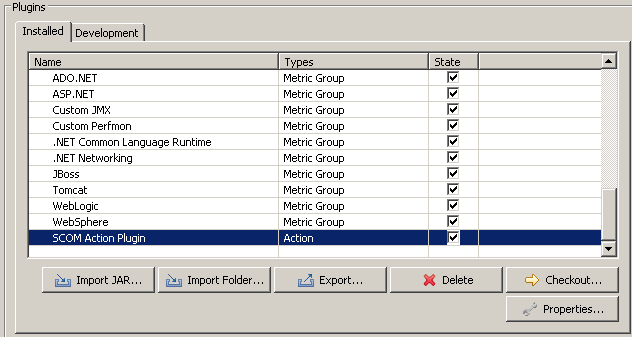
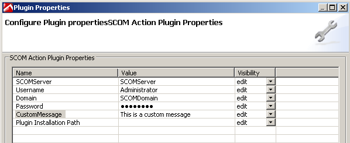
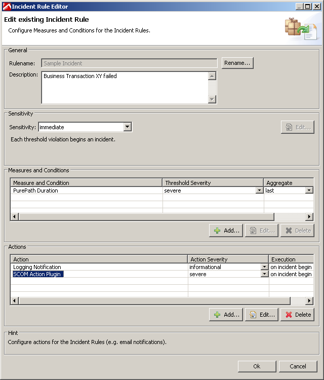
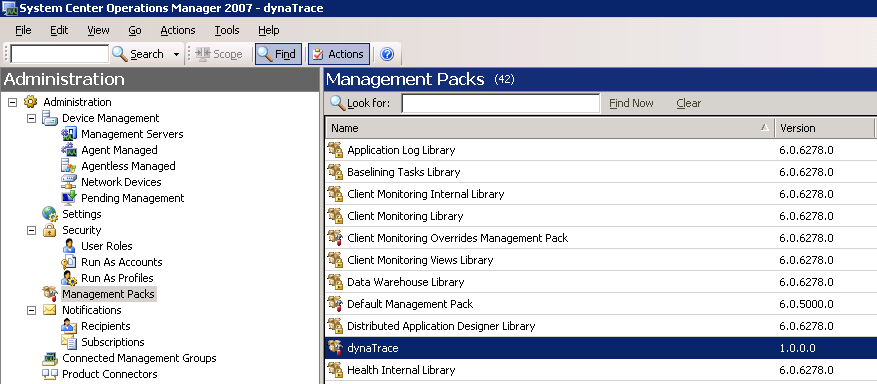
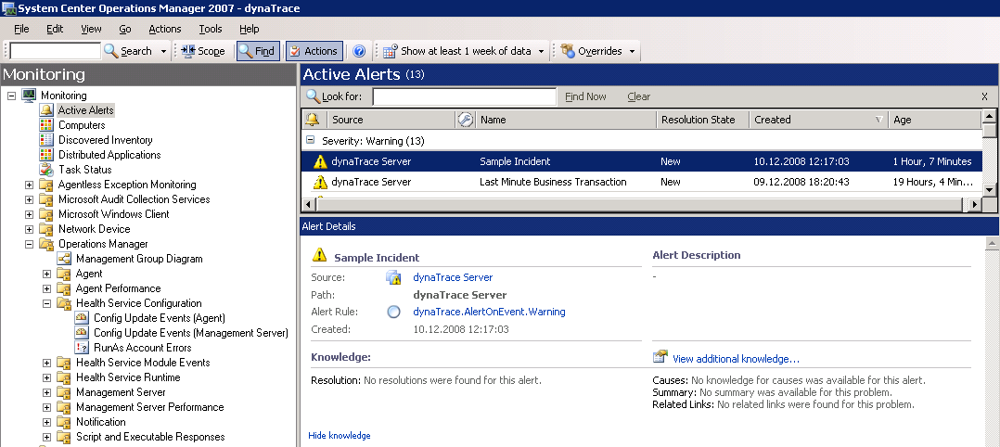

## Overview

This action plugin enables **pushing dynaTrace Incident data to System Center Operations Manager 2007 - 2012**

## Plugin Details

| Name | SCOM Action Monitoring Plugin
| :-- | :--- 
| Author | Andreas Grabner, Steve Caron, Eric Lazar
| Supported dynaTrace Versions | > = 5.5
| Supported SCOM Versions | Tested with System Center Operations Manager 2007 + 2012
| License | [dynaTrace BSD](dynaTraceBSD.txt)
| Support | [Community Supported](https://community.compuwareapm.com/community/display/DL/Support+Levels#SupportLevels-Community)
| Known Problems |The action plugin executes dynaTrace.SCOM.exe on the dynaTrace server. dynaTrace.SCOM.exe is a .NET Console Application. Therefore this Plugin only works on dynaTrace servers that run on windows with an installed version of the .NET 2.0 Framework.
| Release History | 1.2 (updated by Eric Lazar to now also Support SCOM 2012)
| Download | [dynaTrace_SCOMAlert_v1.2.zip](dynaTrace_SCOMAlert_v1.2.zip) (also works with SCOM 2012 - Thanks to Eric Lazar)  
| | [dynaTrace_SCOMAlert_v1.1.zip](dynaTrace_SCOMAlert_v1.1.zip) (works with SCOM 2007  
| | [Download v1.2 Source](dynaTrace_SCOMAlert_v1.2_Source.zip)

##Screenshots

**Imported SCOM Action Plugin**  
  
  
**Plugin Properties**  
  
  
**Incident Definition**  
  
  
**SCOM Management Pack Import**  
  
  
**dynaTrace Alert in SCOM**  

##Install Description

1) Install the dynaTrace_ManagementPack.xml in SCOM. You can do this in the Administration Pane in the SCOM Management Operation Console  
2) Make sure to have the windows service "OpsMgr SDK Service" running. Verify that by looking at the list of windows services.  
3) Initialize dynaTrace SCOM Objects by executing dynaTrace.SCOM.exe with the /i parameter. Execute dynaTrace.SCOM.exe without any parameters to get a list of options that you have. /i allows you to
install the needed SCOM objects on your SCOM 2007 server. dynaTrace.SCOM.exe is a .NET Console Application. It requires an installed .NET 2.0 Framework.  
4) Import the Action Plugin into the dynaTrace Server (via Server Preferences). Click on the Plugins tab and import com.dynatrace.diagnostics.plugin.SCOMAction_1.0.0.jar. After you have imported it
you can specify default values for the plugin properties.  
5) Use the Plugin as Action for an Incident. Make sure to configure all required properties of the Plugin  
** **  
**Plugin-Properties**

  * SCOMServer: name of the server that runs SCOM 

  * Username: username to authenticate on SCOM in order to send events to SCOM 

  * Domain: windows domain name for the user 

  * Password: password for the user 

  * CustomMessage: if specified - this message will be part of the alert description that is generated in SCOM 

  * Plugin Installation Path: (optional). You can install dynaTrace.SCOM.exe, dynaTrace.SCOM.exe.config and the two microsoft dlls in any directory on the dynaTrace Server machine. If you do so you can specify the installation directory here. If this parameter is not specified the dynaTrace.SCOM.exe will be extracted from the dynaTrace SCOM Alert Plugin and stored in a temporary directory on the dynaTrace server  
** **  
**What is part of the SCOM Alert?**  
dynaTrace sends an event to SCOM containing the name of the Incident as Event name, the description of the incident and optionally the custom message as event description and the defined severity as
event severity.  
The event data will then be converted into a SCOM Alert by the dynaTrace Management Pack.

